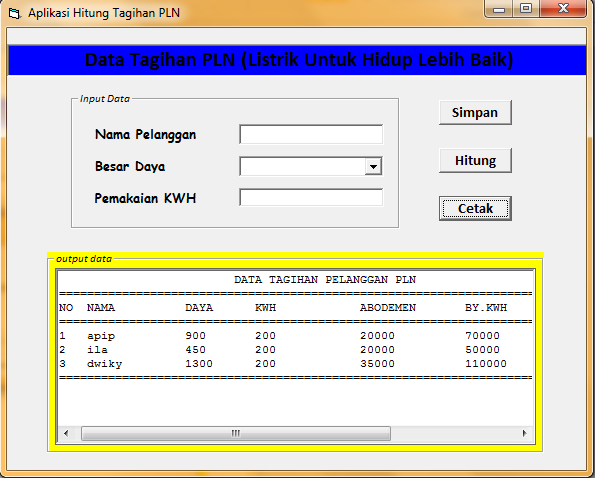

# teknik-looping
membuat beberapa aplikasi dengan teknik looping.  
Looping merupakan salah satu teknik untuk membuat suatu perintah secara berulang-ulang sampai batas yang ditentukan oleh si programmer.    
aplikasi hitung gaji karyawan  
cara kerja :  
>> input data lalu klik simpan (ket: data yang di input bisa dalam jumlah banyak)

>> klik hitung, data akan di hitung

>> lalu klik cetak untuk melihat hasil dari semua data yang di input

 
aplikasi hitung pembayaran listrik  
cara kerja :  
>> input data lalu klik simpan (ket: data yang di input bisa dalam jumlah banyak)

>> klik hitung, data akan di hitung

>> lalu klik cetak untuk melihat hasil dari semua data yang di input

 
aplikasi hitung biaya penginapan hotel  
cara kerja :  
>> input data lalu klik simpan (ket: data yang di input bisa dalam jumlah banyak)

>> klik hitung, data akan di hitung

>> lalu klik cetak untuk melihat hasil dari semua data yang di input

 
aplikasi menentukan grade/nilai kelulusan mahasiswa  
cara kerja :  
>> input data lalu klik simpan (ket: data yang di input bisa dalam jumlah banyak)

>> klik hitung, data akan di hitung

>> lalu klik cetak untuk melihat hasil dari semua data yang di input

 
aplikasi menentukan hasil psikotes  
cara kerja :  
>> input data lalu klik simpan (ket: data yang di input bisa dalam jumlah banyak)

>> klik hitung, data akan di hitung

>> lalu klik cetak untuk melihat hasil dari semua data yang di input

